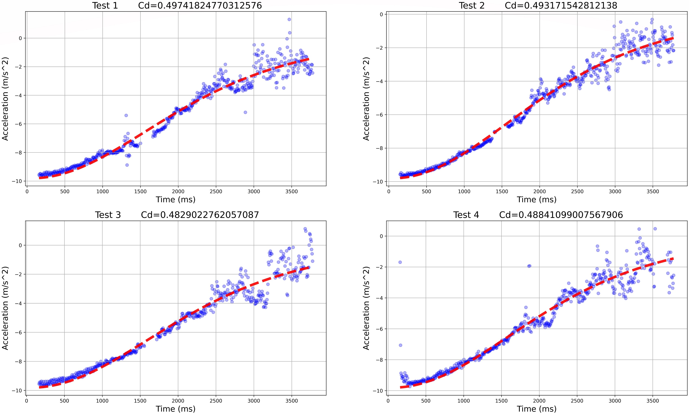
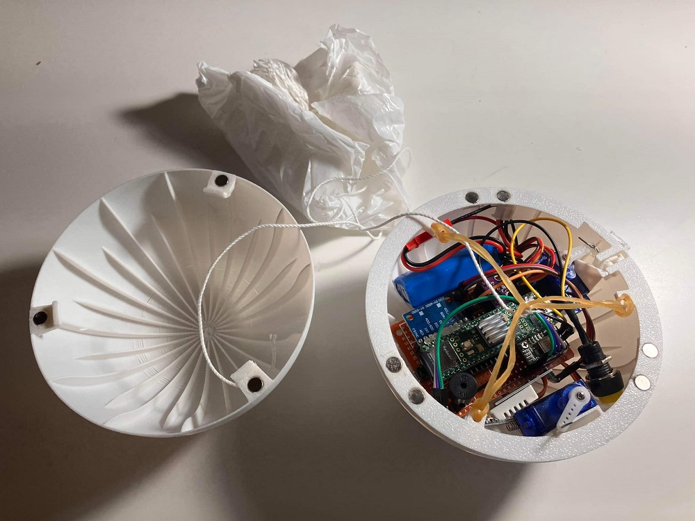
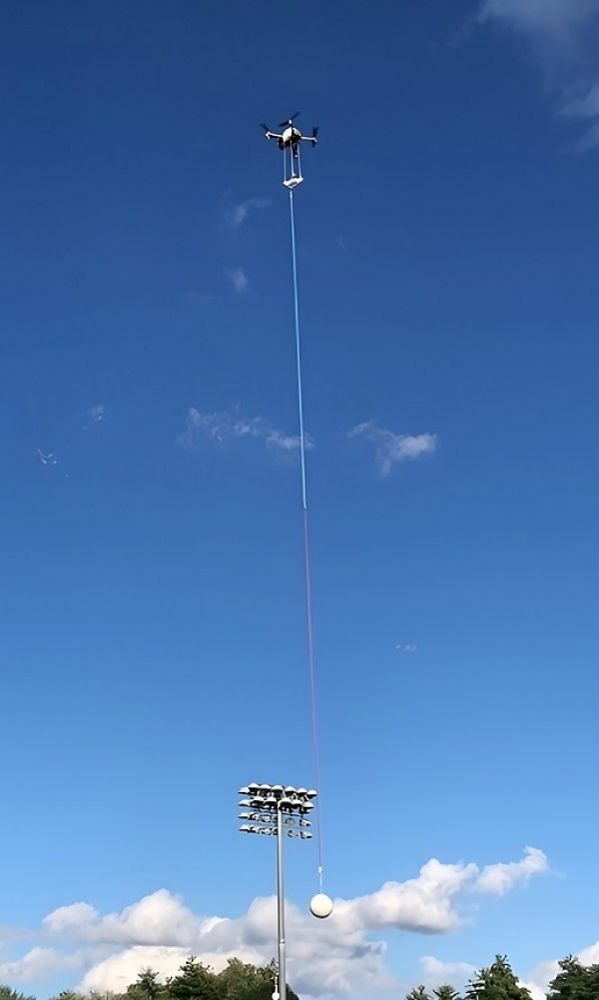
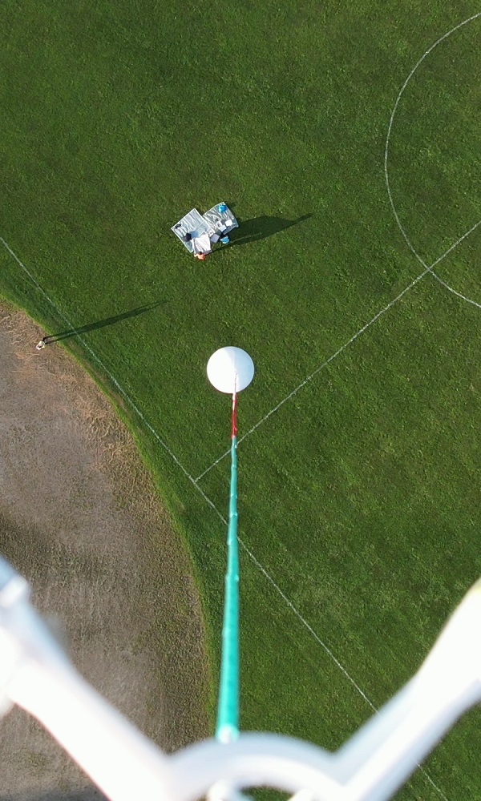
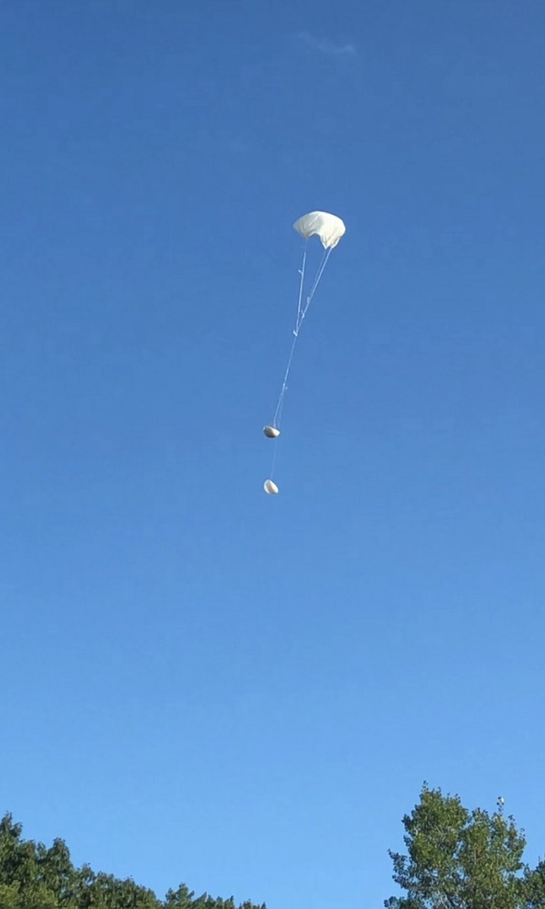
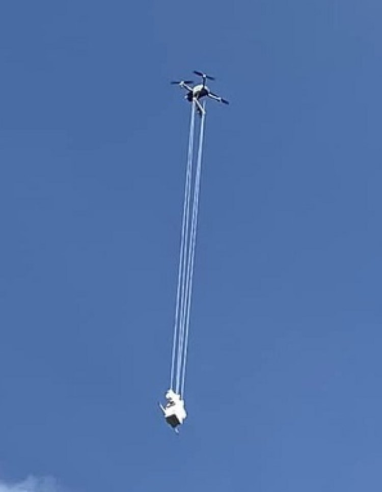

# MIT IEEE Undergraduate Research Technology Conference 2023
I attended MIT URTC at 12th grade and pubshed a poster regarding my research titled:
${\color{red}An\space Alternative\space Method\space to\space Experimentally\space Determine\space Drag\space Coefficient}$.

# Abstract

Determining the drag coefficient of a design is crucial for engineers working with vehicles or objects that traverse through fluids. Traditionally, drag coefficients are determined through wind tunnel testing or computational fluid dynamic simulations, both of which are expensive and mostly accessible to professional labs or research centers. In this study, we explore an alternative method using equipment accessible to students to determine the drag coefficient.

# Experimental Results
We have conducted over 15 test. Here are plots for our 12 tests. 
|  |  |
|-|-|

# Confernce pictures
|  |  | | |
|-|-|-|-|

# My Poster

# Second sphere design
Data collected from my first trial do not show a clear result. After few days thinking, I decided to redign the shpere device to make it bigger. The parachute is now packed inside the shpere which will open in $n$ seconds (programmed in Teensy). The distance between the shpere and drone is 4m.
|  |  |  |  |
|-|-|-|-|

## Field test pictures
|  |  |  |  |  |  |  |  |
|-|-|-|-|-|-|-|-|

## Field test in action (Clieck to see video)
This design gains much better result. We repeated the dropping tests many times at my high school baseball field. 

|| || |
|-|-|-|-|

# First sphere design
This is my first field test to collect data. In this design the shpere is small and parachute is not packed inside the shpere. The distance between the shpere and drone is 2m and there is a thread between them for parachute dragging. 

|  |  |
|-|-|
|Click to see video| Click to see video|

---

# Experiment on measuring the influence distance of the drone propeller turbulence

## Device Design
My desive have two parts: remote controller and measureer with Teensy 4.1. The remote controller sends command to the measureer to start/stop the lowering/rising processng. The result shows that the sensors may be disturbed drametically within 2m.

|||||
|-|-|-|-|

## Experimant in action (Click to see video)
|| |
|-|-|
